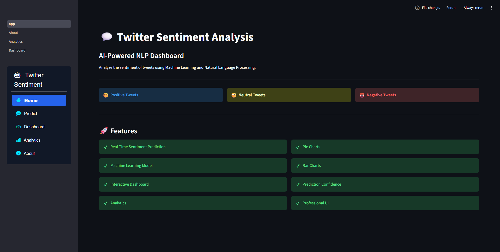
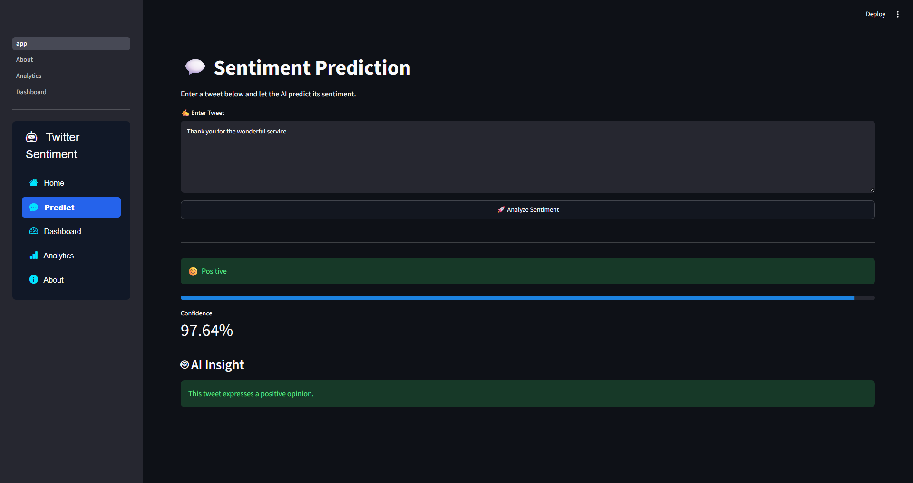
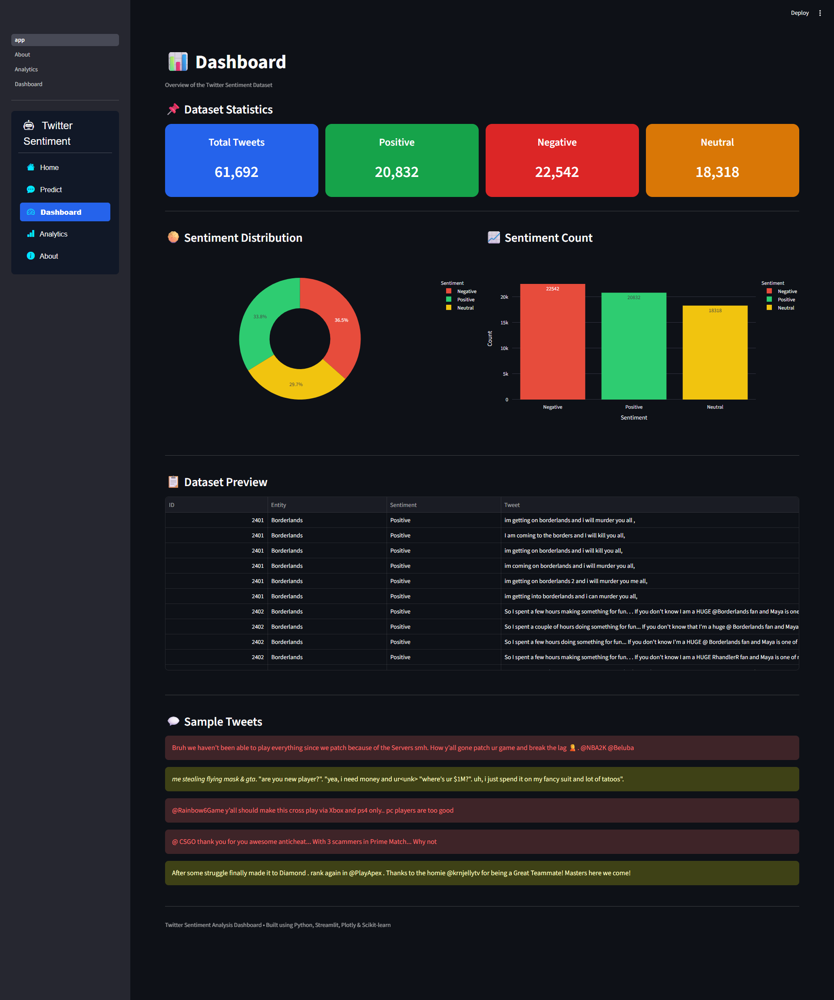
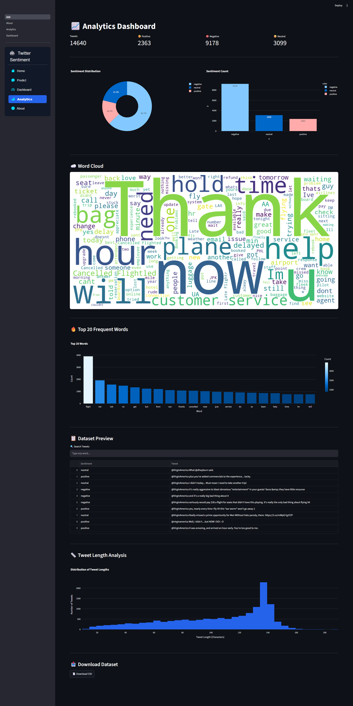
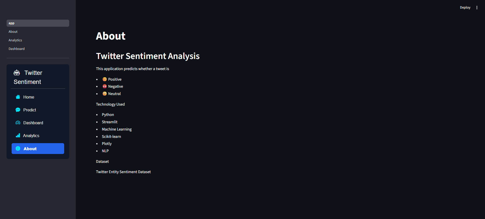

# 💬 Twitter Sentiment Analysis

A Machine Learning and Natural Language Processing (NLP) based web application that predicts whether a tweet is **Positive**, **Negative**, or **Neutral**. The application is built using **Python**, **Scikit-learn**, and **Streamlit** with an interactive dashboard for data visualization and analytics.

---

## 📌 Project Overview

Twitter Sentiment Analysis is an NLP project that analyzes the sentiment of tweets using Machine Learning algorithms. The application preprocesses the input text, converts it into numerical features using TF-IDF Vectorization, and predicts the sentiment using a trained classification model.

---

## ✨ Features

- 😊 Predict Positive, Negative, or Neutral sentiment
- 🤖 Machine Learning based prediction
- 📊 Interactive Dashboard
- 📈 Analytics with Pie Chart and Bar Chart
- ☁️ Word Cloud Visualization
- 🔥 Top 20 Frequent Words Analysis
- 📋 Dataset Preview
- 📱 Clean and Responsive Streamlit UI

---

## 🛠️ Technologies Used

- Python
- Streamlit
- Scikit-learn
- Pandas
- NumPy
- Plotly
- Matplotlib
- WordCloud
- Joblib

---

## 🧠 Machine Learning Workflow

1. Data Collection
2. Data Preprocessing
3. Text Cleaning
4. TF-IDF Vectorization
5. Model Training
6. Model Evaluation
7. Sentiment Prediction
8. Interactive Visualization

---

## 📂 Folder Structure

```text
Twitter-Sentiment-Analysis/
│
├── assets/
├── datasets/
├── models/
├── pages/
├── screenshots/
├── utils/
│
├── app.py
├── train_model.py
├── requirements.txt
├── README.md
└── .gitignore
```

---

## 📊 Dataset

Dataset Used:

**Twitter US Airline Sentiment Dataset**

It contains tweets classified into:

- Positive
- Negative
- Neutral

---

## 📸 Screenshots

### 🏠 Home



---

### 💬 Prediction



---

### 📊 Dashboard



---

### 📈 Analytics



---

### ℹ️ About



---

## 🚀 Installation

### Clone Repository

```bash
git clone https://github.com/Siddhi1845/Twitter-Sentiment-Analysis.git
```

### Go to Project Folder

```bash
cd Twitter-Sentiment-Analysis
```

### Create Virtual Environment

```bash
python -m venv venv
```

### Activate Virtual Environment

Windows

```bash
venv\Scripts\activate
```

### Install Dependencies

```bash
pip install -r requirements.txt
```

### Run Application

```bash
streamlit run app.py
```

---

## 📈 Model Performance

| Model | Accuracy |
|--------|---------:|
| Logistic Regression | **76.58%** |
| Linear SVM | **76.06%** |
| Naive Bayes | **70.18%** |

**Selected Model:** Logistic Regression

---

## 🔮 Future Enhancements

- Deep Learning (LSTM/BERT)
- Real-time Twitter API Integration
- Multi-language Sentiment Analysis
- Emotion Detection
- Deployment on Streamlit Cloud

---

## 👩‍💻 Author

**Siddhi Juvatkar**

Bachelor of Engineering (Information Technology)

GitHub:
https://github.com/Siddhi1845

---

## ⭐ If you like this project

Please consider giving it a ⭐ on GitHub.